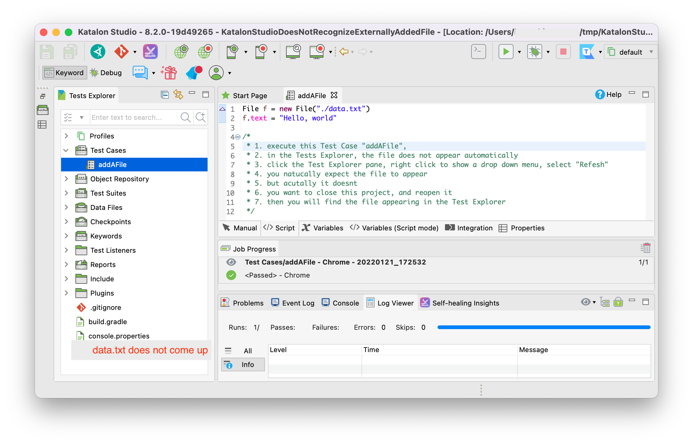
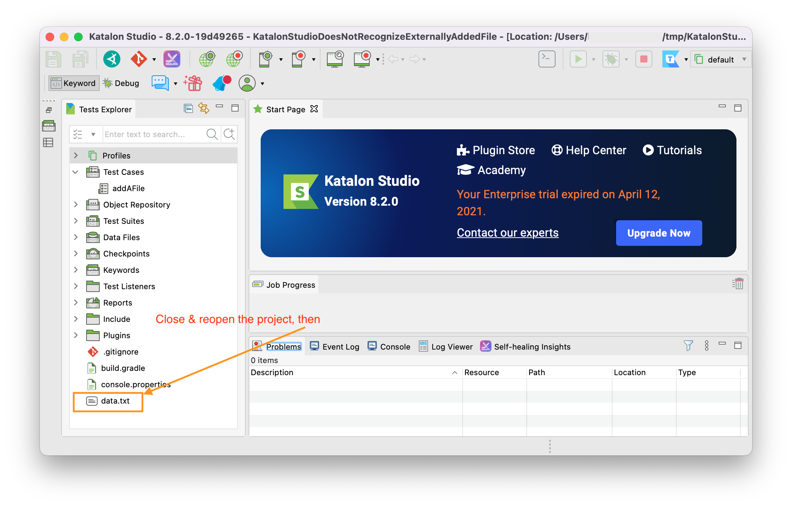

# Katalon Studio does not recognize an externally added file

## Problem

1. Open the [Test Cases/TC1](Scripts/addAFile/Script1642752757717.groovy). It creates a file in the project directory.
```
File f = new File("./data.txt")
f.text = "Hello, world"
```
2. Run the testcase
3. Tests Explorer in Katalon Studio GUI does not show the added file automatically
4. Click the pane of Tests Explorer, right click to show the drop down menu, select "Reflesh"
5. **After "Refresh", still the added file is not shown**.

6. Close the project, and reopen it. Then the added file is finally recognized and showed.


I have been aware of this bug for 4 years. This is too trivial to report. I hoped, it would be fixed by Katalon team without any bug report from users. But this problem survived long time. Finally Jan 2022 I decided to report this as a bug. 

Katalon Studio does not recognize externally added files automatically at all. It is a shame. You know, VSCODE does, IntelliJ IDEA does.

## Environment

- macOS Monterey 12.1
- Katalon Studio 8.2.0